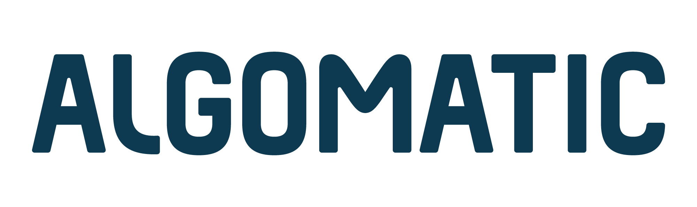

# Awesome AI Agents Guide

The awesome-ai-agent-guide repository is an initial effort to put together a comprehensive list of AI/LLM Agents focused on research and products.

Please note, this repository is a voluntary project and does not list all existing AI agents. This repository is a <u>work in progress</u>, and items are being added gradually.

🙌 Contributions are welcome, so **we look forward to your proactive PRs!**

### Disclaimer
- If there are any errors in interpretation or quotations, please let us know.
- Please be sure to refer to the licenses and terms of use when using.

🌟 If this was helpful, we’d love it if you followed us!: [@AlgomaticJP](https://x.com/AlgomaticJp)

### Recruitment Information

Algomatic creates generative AI-native businesses across various fields. 
We are looking for colleagues with diverse skills.

[Learn More](https://jobs.algomatic.jp/)